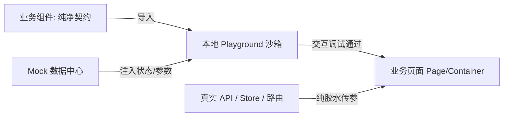

# 业务组件设计与沙箱驱动规范 (Playground-Driven CDD)

## 1. 核心哲学与解决痛点

在 AI 辅助前端开发中，最严重的痛点是：**AI 喜欢在具体的业务页面（Page）里直接堆砌大段 UI，并顺手将真实接口请求（API/Axios）、路由跳转（Vue Router）以及全局状态（Pinia/Vuex）强行绑定在组件内部。**
这导致：
- **副作用缠身**：改动一点点交互，就必须依赖后端真实环境、特定账号权限、深层路由链路。
- **调整极其痛苦**：AI 想要微调一个状态，往往牵一发动全身，破坏页面其他逻辑。
- **无法复用与验证**：散落各处，缺乏独立的边界用例和状态穷举。

### 🌟 核心破局方案（去重型工具绑架）
**Storybook 和 Vite 绝不是必需品！** 核心关键在于建立**“本地交互式 Playground + 副作用隔离”**机制：



1. **副作用归零（Zero Side-Effects）**：组件内部严禁直接发请求、严禁直接调路由跳转、严禁强绑定全局 Store。组件只认 **`Props` 进、`Emits` 出、`Slots` 扩展**。
2. **本地交互沙箱（Local Interactive Playground）**：每个业务组件开发时，必须配套一个轻量级的 `[Component].playground.vue`（或通过已有沙箱）。沙箱内自带**控制面板（Controls）**与**事件日志（Event Logger）**，脱离后端即可随时验证所有交互。
3. **安全装配（Safe Assembly）**：只有在 Playground 中把常规态、加载态、空数据、极限异常态跑顺之后，业务页面才引入该组件做数据打桩。

---

## 2. 触发时机

遇到以下任一场景，AI 必须主动激活本 Skill：
1. **抽离业务组件**：用户提出“封装/抽象一个业务组件”（如审核弹窗、人员选择器、状态时间轴、高级筛选栏等）。
2. **大页面拆解**：在编写或重构业务页面时，某块业务交互/UI 预估代码超过 50 行，或具备潜在跨页面复用价值。
3. **解耦重构**：发现现有业务组件直接调用了后端接口或路由，导致难以调试或复用，需进行纯洁化重构。

---

## 3. 标准开发工作流 (5 步极简闭环)

### 步骤 1：契约先行与副作用隔离 (Contract First)
- 在组件开发前，先定义纯净的 TypeScript 契约接口：
  - **Props**：纯数据输入（带严格默认值）。
  - **Emits**：纯事件通知（包含语义化命名与详细携带载荷 payload）。
  - **Slots**：预留布局与定制扩展。
- **红线**：禁止在组件内 `import axios`、禁止直接读取/写入全局 Pinia 单例、禁止直接调用 `useRoute().params`。

### 步骤 2：组件编写 (Pure UI Component)
- **位置**：`src/components/business/[ComponentName]/index.vue`
- 基于项目已有的 UI 框架（如 `ant-design-vue` / `element-plus` 等）组织界面。
- 所有状态变更通过触发 `emit('update:value', val)` 或 `emit('submit', payload)` 向上通知。

### 步骤 3：编写本地 Mock 数据 (Mock Presets)
- **位置**：`src/components/business/[ComponentName]/mock.ts`
- 准备至少 4 组用于检验极限场景的数据：
  1. `mockNormalData`：常规业务展示数据。
  2. `mockLoadingState`：加载中/骨架态。
  3. `mockEmptyData`：空数据/无权限态。
  4. `mockEdgeData`：极限测试数据（如 200 字超长标题、几十个 Tag 标签换行、极端边界数值）。

### 步骤 4：构建本地交互式 Playground (Interactive Sandbox)
- **位置**：`src/components/business/[ComponentName]/playground.vue`
- **沙箱三要素**：
  1. **主展示区**：渲染被测组件。
  2. **交互控制台（Controls Panel）**：提供 Switch/Button 快速切换 `loading`、`visible`、`disabled` 及切换不同 Mock 场景。
  3. **事件捕捉看板（Event Log）**：当组件向外触发 emit 时，在沙箱下方直观打印事件名与参数，无需在终端或深层 console 里捞日志。
- **调试方式**：临时挂载到项目现有开发路由（如 `/dev/playground` 或任意页面临时引入），随改随调，即刻见效。

### 步骤 5：业务页面安全装配 (Page Assembly)
- 只有在 Playground 验收完毕后，业务页面（Page）才作为“装配工”引入组件：
  ```vue
  <!-- 业务页面只负责：调用真实 API -> 获取数据 -> 传给 Props -> 监听 Emits -> 刷新业务 -->
  <UserSelectModal
    v-model:visible="modalVisible"
    :users="userList"
    :loading="fetchLoading"
    @confirm="handleAssignUser"
  />
  ```

---

## 4. 黄金标准模板 (Golden Templates)

### 模板 1：纯净业务组件 (`UserSelectModal/index.vue`)
```vue
<script setup lang="ts">
import { computed } from 'vue';

// 1. 契约定义
export interface UserItem {
  id: string | number;
  name: string;
  avatar?: string;
  department: string;
  status: 'active' | 'disabled';
}

export interface UserSelectProps {
  visible: boolean;
  title?: string;
  users?: UserItem[];
  selectedIds?: (string | number)[];
  maxSelectCount?: number;
  loading?: boolean;
}

const props = withDefaults(defineProps<UserSelectProps>(), {
  title: '选择指派责任人',
  users: () => [],
  selectedIds: () => [],
  maxSelectCount: 5,
  loading: false,
});

// 2. 纯净事件（无网络/路由副作用）
const emit = defineEmits<{
  (e: 'update:visible', value: boolean): void;
  (e: 'update:selectedIds', ids: (string | number)[]): void;
  (e: 'confirm', selectedUsers: UserItem[]): void;
  (e: 'cancel'): void;
}>();

const handleClose = () => {
  emit('update:visible', false);
  emit('cancel');
};

const handleSelect = (user: UserItem) => {
  const current = [...props.selectedIds];
  const idx = current.indexOf(user.id);
  if (idx > -1) {
    current.splice(idx, 1);
  } else if (current.length < props.maxSelectCount) {
    current.push(user.id);
  }
  emit('update:selectedIds', current);
};

const handleConfirm = () => {
  const chosen = props.users.filter(u => props.selectedIds.includes(u.id));
  emit('confirm', chosen);
  emit('update:visible', false);
};
</script>

<template>
  <a-modal
    :open="props.visible"
    :title="props.title"
    :confirm-loading="props.loading"
    @ok="handleConfirm"
    @cancel="handleClose"
  >
    <div class="user-select-body">
      <a-spin :spinning="props.loading">
        <a-empty v-if="!props.loading && props.users.length === 0" description="暂无可选人员" />
        
        <div v-else class="user-list">
          <div
            v-for="user in props.users"
            :key="user.id"
            class="user-row"
            :class="{ active: props.selectedIds.includes(user.id) }"
            @click="handleSelect(user)"
          >
            <span>{{ user.name }} ({{ user.department }})</span>
            <a-tag v-if="props.selectedIds.includes(user.id)" color="blue">已选</a-tag>
          </div>
        </div>
      </a-spin>
    </div>
  </a-modal>
</template>

<style scoped>
.user-select-body { min-height: 200px; max-height: 400px; overflow-y: auto; }
.user-row { display: flex; justify-content: space-between; padding: 8px 12px; cursor: pointer; border-radius: 4px; }
.user-row:hover { background-color: #f5f5f5; }
.user-row.active { background-color: #e6f7ff; color: #1890ff; font-weight: 500; }
</style>
```

### 模板 2：Mock 数据字典 (`UserSelectModal/mock.ts`)
```typescript
import type { UserItem } from './index.vue';

// 1. 常规正常数据
export const mockNormalUsers: UserItem[] = [
  { id: 1, name: '张三', department: '前端研发部', status: 'active' },
  { id: 2, name: '李四', department: '后端架构组', status: 'active' },
  { id: 3, name: '王五', department: '产品设计中心', status: 'active' },
];

// 2. 极限超长/边界数据
export const mockEdgeUsers: UserItem[] = [
  { id: 101, name: '欧阳超级长名字测试工程师ABCDEFG', department: '全球海外协同拓展与本地化支持部超长部门名称', status: 'active' },
  ...Array.from({ length: 50 }, (_, i) => ({
    id: 200 + i,
    name: `批量用户_${i + 1}`,
    department: '压力测试部门',
    status: 'active' as const,
  })),
];
```

### 模板 3：本地交互式 Playground (`UserSelectModal/playground.vue`)
```vue
<script setup lang="ts">
import { ref } from 'vue';
import UserSelectModal from './index.vue';
import { mockNormalUsers, mockEdgeUsers } from './mock.ts';

// 状态控制器
const visible = ref(true);
const loading = ref(false);
const currentDataset = ref<'normal' | 'empty' | 'edge'>('normal');
const selectedIds = ref<(string | number)[]>([1]);

// 数据场景切换
const userDataSource = computed(() => {
  if (currentDataset.value === 'empty') return [];
  if (currentDataset.value === 'edge') return mockEdgeUsers;
  return mockNormalUsers;
});

// 事件日志看板
const eventLogs = ref<string[]>([]);
const logEvent = (name: string, payload: any) => {
  const time = new Date().toLocaleTimeString();
  eventLogs.value.unshift(`[${time}] ${name}: ${JSON.stringify(payload)}`);
};
</script>

<template>
  <div class="playground-wrapper">
    <div class="playground-header">
      <h2>🛠️ UserSelectModal 本地交互调试沙箱</h2>
      <p>脱离具体页面与后端接口，直接调整下述开关验证组件表现：</p>
    </div>

    <!-- 1. 动态控制栏 -->
    <div class="controls-panel">
      <a-button type="primary" @click="visible = true">打开弹窗</a-button>
      
      <div class="control-item">
        <span>Loading 状态:</span>
        <a-switch v-model:checked="loading" />
      </div>

      <div class="control-item">
        <span>数据场景:</span>
        <a-radio-group v-model:value="currentDataset">
          <a-radio-button value="normal">标准数据 (3条)</a-radio-button>
          <a-radio-button value="empty">空数据态 (0条)</a-radio-button>
          <a-radio-button value="edge">极限长文本 (50+条)</a-radio-button>
        </a-radio-group>
      </div>

      <a-button danger @click="eventLogs = []">清空事件日志</a-button>
    </div>

    <!-- 2. 被测组件 -->
    <UserSelectModal
      v-model:visible="visible"
      v-model:selected-ids="selectedIds"
      :users="userDataSource"
      :loading="loading"
      @confirm="(users) => logEvent('confirm', users)"
      @cancel="() => logEvent('cancel', null)"
    />

    <!-- 3. 实时事件捕捉看板 -->
    <div class="event-logs">
      <h4>📡 实时交互事件监听 (Emits Logger):</h4>
      <div v-if="eventLogs.length === 0" class="log-empty">暂无事件触发，请操作弹窗...</div>
      <pre v-for="(log, idx) in eventLogs" :key="idx">{{ log }}</pre>
    </div>
  </div>
</template>

<style scoped>
.playground-wrapper { padding: 24px; background: #fafafa; min-height: 100vh; font-family: sans-serif; }
.controls-panel { display: flex; align-items: center; gap: 16px; background: #fff; padding: 16px; border-radius: 8px; margin: 16px 0; border: 1px solid #eee; }
.control-item { display: flex; align-items: center; gap: 8px; font-size: 14px; }
.event-logs { background: #1e1e1e; color: #4af626; padding: 16px; border-radius: 8px; margin-top: 24px; max-height: 250px; overflow-y: auto; }
.event-logs h4 { color: #fff; margin-top: 0; }
.event-logs pre { margin: 4px 0; font-size: 12px; font-family: monospace; }
.log-empty { color: #888; font-size: 12px; }
</style>
```

---

## 5. AI 编码铁律红线 (Hard Rules for AI)

在编写任何业务组件代码时，AI 必须严格遵从以下 4 条底线：

1. **🚫 严禁边写组件边绑直接网络请求**：
   - 严禁在业务展示组件中直接 `import request from '@/utils/request'` 或直接写 API 调用。
   - 数据必须通过 `Props` 传入，如果组件确实需要自制异步行为，必须通过依赖注入（`provide/inject`）或 Props 传入异步回调函数，确保在 Playground 中随时可用 Mock 数据替换。
2. **🚫 严禁组件内部直接操作路由**：
   - 严禁在纯组件里写 `router.push(...)`。如需跳转，通过 `emit('navigate', target)` 抛出给外层容器决定。
3. **🚫 严禁在业务 Page 模版中内联大块逻辑**：
   - 凡是业务弹窗（Modal）、业务抽屉（Drawer）、复杂详情卡片，一律禁止在页面里直接写上百行模板，必须拆分成独立子组件。
4. **🚫 严禁先装配后验证**：
   - 必须先写出 `mock.ts` 和 `playground.vue`（或在已有沙箱中），确认组件状态完整后，才准将组件引入业务页面！
