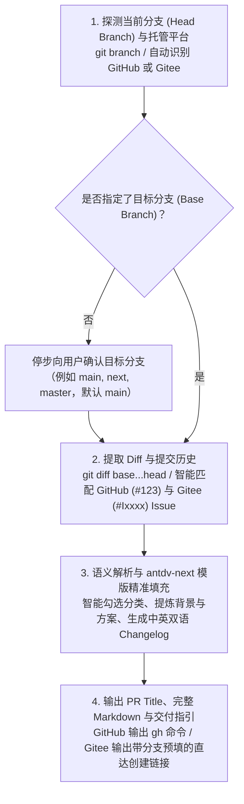

# GitHub & Gitee PR Creator (基于 antdv-next 官方模版规范)

Use this skill to transform your current feature branch changes into a standard, publication-ready Pull Request draft on **both GitHub and Gitee (码云)** based on the official **antdv-next** PR template.

---

## 🎯 核心交互流程（类似 Review 流程）



---

## 🌐 平台支持对比 (GitHub vs Gitee)

| 特性 | GitHub 模式 | Gitee (码云) 模式 |
| :--- | :--- | :--- |
| **平台识别** | 自动识别 `github.com` remote | 自动识别 `gitee.com` remote |
| **Issue 语法** | 自动匹配 `#1234` ➔ `fix #1234` | 自动匹配 `#I8M7KZ` 或 `#1234` ➔ `fix #I8M7KZ` |
| **网页直达链接** | `https://github.com/owner/repo/compare/base...head?expand=1` | `https://gitee.com/owner/repo/pulls/new?source=head&target=base` |
| **命令行/交付** | 提供 `gh pr create` 一键创建命令 | 提供带预设分支的直达创建 URL 及格式化草稿 |

> 📖 **深入对比**：详见 [references/platform-compatibility.md](references/platform-compatibility.md)。

---

## 🚀 调用方式 (How to Invoke)

| AI 编程助手 / 环境 | 触发方式 | 推荐指令示例 |
| :--- | :--- | :--- |
| **OpenAI Codex CLI** | `$github-pr-creator` | `使用 $github-pr-creator 帮我提 PR 到 main 分支` |
| **Claude Code** | `/pr` 或自然语言 | `使用 github-pr-creator 检查当前分支，生成 GitHub/Gitee PR 说明草稿` |
| **Cursor IDE** | `@github-pr-creator` / Rule | 在 Composer 中 `@github-pr-creator` 或调用规则 |
| **Antigravity / Gemini CLI** | `$github-pr-creator` 或自然语言 | `调用 github-pr-creator 准备在 Gitee 上向 master 提交合并请求` |
| **命令行脚本直跑** | CLI 脚本 | `node .../generate_pr_draft.js --base main --platform gitee` |

---

## 📋 详细工作流规范

### Step 1: 确定分支与平台基准（Branch & Platform Selection）
1. **识别平台**：自动检测 `git remote get-url origin`，如果是 Gitee 则启动 Gitee 模式，否则默认 GitHub 模式；用户也可以直接在指令中指定（如“在 Gitee 上提 PR”）。
2. **获取当前分支**：运行 `git branch --show-current` 或 `git rev-parse --abbrev-ref HEAD`。
   - 若当前在 `main` 或 `master` 分支，提示用户：“当前处于主分支，建议先切出特性分支（feature/xxx 或 fix/yyy）后再提 PR”。
3. **确认目标分支 (Target Base Branch)**：
   - 如果用户在 Prompt 中已说明（如“PR 到 next”），则使用该分支作为 Base。
   - 若用户未说明，**像 Code Review 一样主动询问用户**：
     > 🎯 **请确认 PR 目标分支**：
     > 检测到当前平台：`[GitHub / Gitee]`，当前工作分支为：`[current_branch]`
     > 请问需要将代码合并到哪个目标分支？（常用分支：`main` / `next` / `master`，直接回车默认为 `main`）

### Step 2: 变更提取与 Issue 关联（Diff & Issue Extraction）
运行以下命令提取差异范围：
```bash
git log --no-merges --pretty=format:"%h %s" <base>..<head>
git diff --stat <base>...<head>
git diff <base>...<head>
```
提取核心信息：
1. **修改的模块与组件**（如 `components/select/`, `components/table/`）；
2. **关联 Issue 提取**：
   - GitHub：匹配 `#123`；
   - Gitee：匹配 `#Ixxxx`（如 `#I8M7KZ`）或 `#123`；
3. **变更性质**（新功能、Bug 修复、样式重构、TypeScript 类型优化、测试用例等）。

### Step 3: 精准填充 antdv-next 规范模版
1. **分类勾选 (`### 🤔 本次变更属于 ...`)**：
   - 依据修改文件与提交精准打勾 `[x]`（如修改 `.d.ts` 勾选 `🤖 TypeScript`，修改样式勾选 `💄 组件样式`，修改测试勾选 `✅ 测试用例`）。
2. **关联 Issue (`### 🔗 相关 Issue`)**：
   - 填入对应平台的语法（GitHub: `close #123` / Gitee: `close #I8M7KZ`）。
3. **背景与方案 (`### 💡 背景与方案`)**：
   - 阐述改动背景与具体方案。
4. **变更日志 (`### 📝 变更日志`)**：
   - 遵循 Keep-a-Changelog 准则，面向**组件使用者/开发者**描述直接影响。
   - 必须提供 **中英双语（🇺🇸 English & 🇨🇳 Chinese）** 表格。

### Step 4: 平台定制交付物 (Deliverables)
1. **建议的 PR 规范标题**：遵循 Conventional Commits（如 `fix(select): resolve dropdown offset issue (#I8M7KZ)`）。
2. **完整的 PR Markdown 描述文本**。
3. **平台快捷创建指引**：
   - **GitHub**：提供 `gh pr create --base ... --head ...` 命令行；
   - **Gitee**：提供预设参数的网页一键直达创建链接（`https://gitee.com/.../pulls/new?source=...&target=...`，在终端中直接点击即可进入已选好分支的新建页面）。

---

## 📖 参考模版源文件
- 英文源模版：[references/templates/antdv-pr-template.md](references/templates/antdv-pr-template.md)
- 中文源模版：[references/templates/antdv-pr-template-cn.md](references/templates/antdv-pr-template-cn.md)
- 平台兼容指南：[references/platform-compatibility.md](references/platform-compatibility.md)
