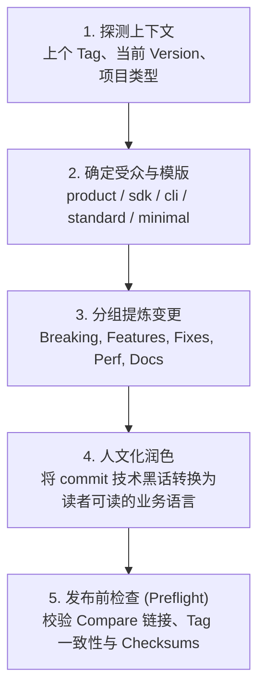

# GitHub Release Publisher

Use this skill to transform repository commit history and pull requests into a polished, publication-ready GitHub Release draft.

---

## 🎨 5 大现代 Release 模版速查 (Template Decision Matrix)

根据仓库性质与目标受众，选择最贴合的模板（或让本 Skill 自动推断）：

| 模版 (`--template`) | 核心受众 | 典型项目类型 | 核心焦点与特色 |
| :--- | :--- | :--- | :--- |
| **`product`** (默认) | 终端用户 / 业务方 | Web App、SaaS、桌面应用、小程序 | 🚀 突出直观价值、体验优化、新功能、社区贡献者致谢 |
| **`sdk`** | 下游开发者 / 架构师 | 开源库、npm/PyPI 包、框架、API Client | 🚨 **破坏性变更置顶**、API 迁移指引、代码示例、性能提升 |
| **`cli`** | 运维 / DevOps / 终端用户 | 命令行工具、Docker 镜像、系统服务 | 📥 **一键安装/升级命令**、参数配置变更、二进制 SHA-256 校验和 |
| **`standard`** | 开源社区 / CI/CD 流水线 | 严谨开源项目、底层基础库 | 遵循 Keep-a-Changelog 与 SemVer 规范 (Added, Changed, Removed, Fixed) |
| **`minimal`** | 日常维护者 / 尝鲜用户 | Patch 小版本、日常 Bugfix、高频发版 | 极简提交与 PR 清单、差异对比链接，无多余冗述 |

> 📖 **深入示例与详细格式**：详见 [references/templates-guide.md](references/templates-guide.md)。

---

## 🚀 Quick Start (快速开始)

### 方式一：直接运行内置生成脚本

脚本会自动读取当前 Git 仓库的提交记录与历史 Tag，并智能探测项目名称：

```bash
# 1. 默认模版 (Product/SaaS 面向用户)
node /Users/carl/Desktop/carl-github/skills/github-release-publisher/scripts/generate_release_notes.js \
  --repo /path/to/repo \
  --version v1.2.0

# 2. 开发者 SDK / 类库模版 (突出 Breaking Changes 与迁移)
node /Users/carl/Desktop/carl-github/skills/github-release-publisher/scripts/generate_release_notes.js \
  --repo /path/to/repo \
  --version v2.0.0 \
  --template sdk

# 3. 命令行工具模版 (包含快速安装命令与校验和)
node /Users/carl/Desktop/carl-github/skills/github-release-publisher/scripts/generate_release_notes.js \
  --repo /path/to/repo \
  --version v1.0.0 \
  --template cli

# 4. 标准规范模版 (Keep-a-Changelog)
node /Users/carl/Desktop/carl-github/skills/github-release-publisher/scripts/generate_release_notes.js \
  --repo /path/to/repo \
  --version v1.1.0 \
  --template standard
```

### 方式二：在 AI 助手内自然语言调用

- **Codex**: `$github-release-publisher`
- **Claude Code / Antigravity / Cursor**:
  > “使用 github-release-publisher 检查从上个版本 tag 至今的所有提交，采用 sdk 模版生成一份面向开源开发者的 Release 发版草稿，重点突出破坏性变更。”

---

## 🔄 标准发版工作流 (Release Workflow)



### 1. 建立发布上下文 (Build Context)
收集发版所需的基础信息：
- 待发布的版本号（例如 `v1.5.0`）
- 上一个稳定 Tag（若未指定，自动通过 `git tag --sort=-v:refname` 提取）
- 提交/PR 变更区间
- 目标受众与选定模版

### 2. 语义化归类与提炼 (Categorize & Synthesize)
不要直接罗列机械式的原始 git commit 信息。按语义提取核心价值：
- **Breaking Changes**：标记有破坏性变动的 API，写明 Migration 步骤与代码对比。
- **Highlights**：提炼 2~3 个最显著的版本价值点。
- **Features & Fixes**：过滤合并无关的 `Merge pull request...` 或单次格式微调。

### 3. 发布前校验清单 (Preflight Validation Checklist)
发布草稿完成前，务必检查：
- [ ] 版本 Tag 与发布标题严格一致。
- [ ] Compare 对比链接（`.../compare/vA...vB`）准确可用。
- [ ] 若为 CLI 模版，安装命令与架构包名准确，校验和占位已处理。
- [ ] 若含破坏性变更，必须醒目置顶，不得混在普通修复中。
