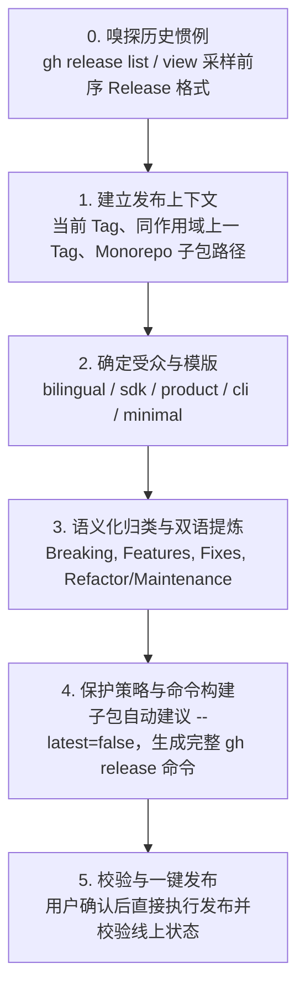

# GitHub Release Publisher

Use this skill to transform repository commit history and pull requests into a polished, publication-ready GitHub Release draft and publish it via GitHub CLI (`gh`).

---

## 🎨 现代 Release 模版决策矩阵 (Template Decision Matrix)

根据仓库性质与目标受众，选择最贴合的模板（或让本 Skill 自动推断）：

| 模版 (`--template`) | 核心受众 | 典型项目类型 | 核心焦点与特色 |
| :--- | :--- | :--- | :--- |
| **`bilingual`** (推荐/默认) | 国内外开发者 / 开源社区 | Ant Design / Vue 生态、开源组件库、多语言项目 | 🇨🇳/🇺🇸 **中英双语对齐**（`英文改动 — 中文说明`）、纯粹技术描述、PR 清单 |
| **`sdk`** | 下游开发者 / 架构师 | 开源库、npm/PyPI 包、框架、API Client | 🚨 **破坏性变更置顶**、API 迁移指引、代码对比、性能提升 |
| **`product`** | 终端用户 / 业务方 | Web App、SaaS、桌面应用、小程序 | 🚀 突出直观体验优化、新功能、版本亮点与致谢 |
| **`cli`** | 运维 / DevOps / 终端用户 | 命令行工具、Docker 镜像、系统服务 | 📥 **一键安装/升级命令**、参数配置变更、二进制 SHA-256 校验和 |
| **`standard`** | 规范开源团队 / CI 流水线 | 严谨底层基础库 | 遵循 Keep-a-Changelog 与 SemVer 规范 (Added, Changed, Removed, Fixed) |
| **`minimal`** | 日常维护者 / 尝鲜用户 | Patch 小版本、日常 Bugfix、高频发版 | 极简提交与 PR 清单、差异对比链接，无多余冗述 |

> 📖 **深入示例与详细格式**：详见 [references/templates-guide.md](references/templates-guide.md)。

---

## 🚀 Quick Start (快速开始)

### 方式一：直接运行内置生成脚本

脚本会自动读取当前 Git 仓库的提交记录与历史 Tag，智能解析 Monorepo 多包作用域标签（Scoped Tags）与 Compare 链接：

```bash
# 1. 中英双语规范模版 (默认，直接输出 gh release create 一键发布命令)
node /path/to/github-release-publisher/scripts/generate_release_notes.js \
  --repo /path/to/repo \
  --version @antdv-next/x@1.2.4 \
  --gh-cmd

# 2. Monorepo 子包精准发布 (过滤子包路径 + 自动锁定 --latest=false 保护主包)
node /path/to/github-release-publisher/scripts/generate_release_notes.js \
  --repo /path/to/repo \
  --version @antdv-next/x-markdown@0.2.0 \
  --path packages/x-markdown \
  --gh-cmd

# 3. 开发者 SDK 模版 (突出 Breaking Changes 与迁移)
node /path/to/github-release-publisher/scripts/generate_release_notes.js \
  --repo /path/to/repo \
  --version v2.0.0 \
  --template sdk

# 4. 直接执行 GitHub 发布 (--publish)
node /path/to/github-release-publisher/scripts/generate_release_notes.js \
  --repo /path/to/repo \
  --version v1.0.0 \
  --publish
```

### 方式二：在 AI 助手内自然语言调用

- **Antigravity / Claude Code / Cursor / Codex**:
  > “使用 github-release-publisher 帮我生成刚发布的 @antdv-next/x@1.2.4 release，参考仓库既有中英双语风格，不要营销亮点，并生成 gh release 发布命令。”

---

## 🔄 标准发版工作流 (Release Workflow)


```mermaid
flowchart TD
    W0["0. 嗅探历史惯例<br/>gh release list / view 采样前序 Release 格式"] --> W1["1. 建立发布上下文<br/>当前 Tag、同作用域上一 Tag、Monorepo 子包路径"]
    W1 --> W2["2. 确定受众与模版<br/>bilingual / sdk / product / cli / minimal"]
    W2 --> W3["3. 语义化归类与双语提炼<br/>Breaking, Features, Fixes, Refactor/Maintenance"]
    W3 --> W4["4. 保护策略与命令构建<br/>子包自动建议 --latest=false，生成完整 gh release 命令"]
    W4 --> W5["5. 校验与一键发布<br/>用户确认后直接执行发布并校验线上状态"]
```

### 0. 嗅探历史风格 (Inspect Historical Style)
在生成前，AI 助手应优先运行 `gh release view <prev-tag>` 或 `gh release list`，嗅探该仓库的历史发版习惯：
- 是否采用中英双语（`英文改动 — 中文说明`）？
- 是否包含营销亮点（Highlights）还是纯技术导向？
- PR 列表格式与标题惯例。

### 1. 建立发布上下文 (Build Context)
- **Monorepo Scoped Tags**：识别版本号前缀（如 `@antdv-next/x-markdown@`、`@scope/core@`、`v`）。上一版本 Tag 必须**严格匹配同前缀**（例如不能把 `x-markdown` 的前序版本错认成 `x`）。
- **过滤 Prerelease**：正式发版默认自动跳过 `-beta.x` / `-alpha.x` 标签，直接与上一个正式稳定版本对比。
- **子目录过滤**：若为 Monorepo 子包，通过 `--path <dir>` 仅抓取受该子包改动影响的 Commit / PR。

### 2. 语义化归类与双语润色 (Categorize & Bilingual Synthesis)
- **拒绝机械原样罗列**：将技术黑话转化为可读性强的改动阐述。
- **中英双语对齐**：格式统一采用 `• type(scope): English title — 中文改动说明 (#PR)`。
- **去浮夸营销化**：对类库与底层基础项目，优先直奔主题展示 Features、Bug Fixes 与 Refactor。

### 3. 发布前校验与 `--latest` 保护清单 (Preflight Checklist)
发布草稿或执行发布前，务必确认：
- [ ] **版本 Tag 与发布标题严格一致**。
- [ ] **Compare 对比链接准确**（必须包含完整的 `owner/repo`，而非单段目录名）。
- [ ] **Latest 标签归属**：若当前发布的是 Monorepo 的**次级子包**（如 `x-markdown`, `x-skill`, 插件等），必须显式带上 `--latest=false`，严禁意外覆盖核心主包的 `Latest` 徽标！
- [ ] **破坏性变更醒目置顶**（若含 Breaking Changes，必须包含警告框与迁移说明）。
